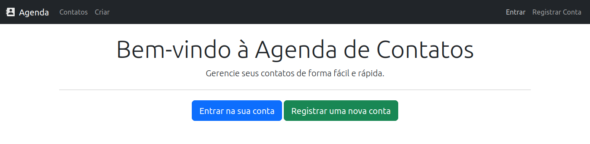
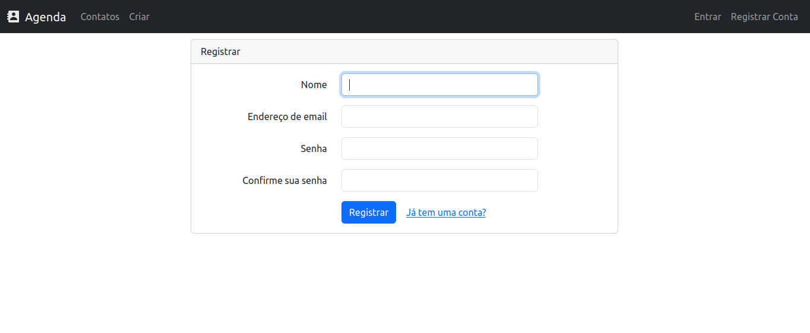
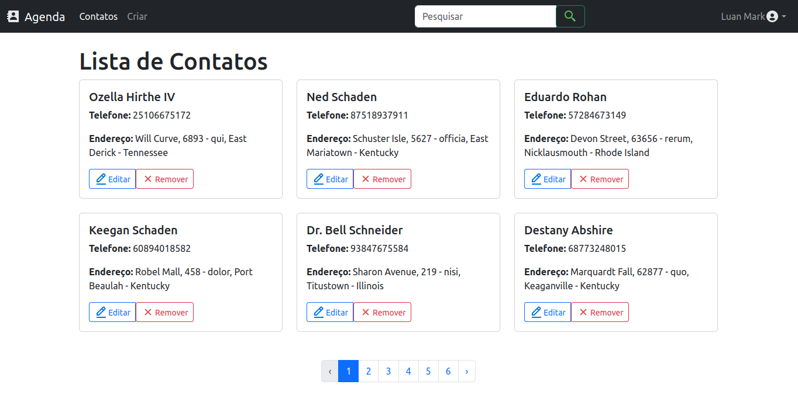
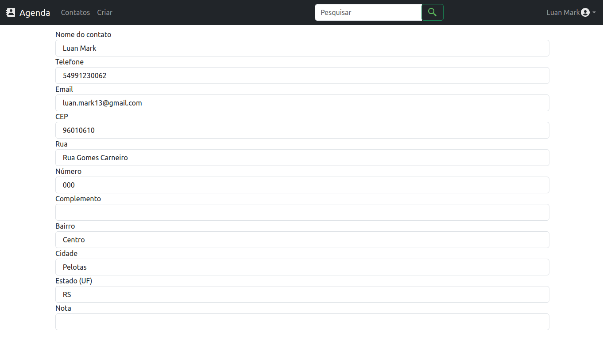
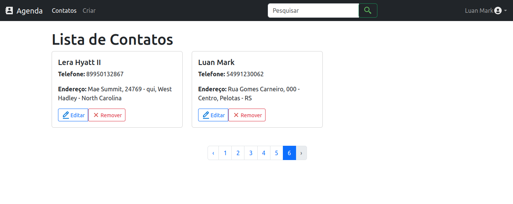
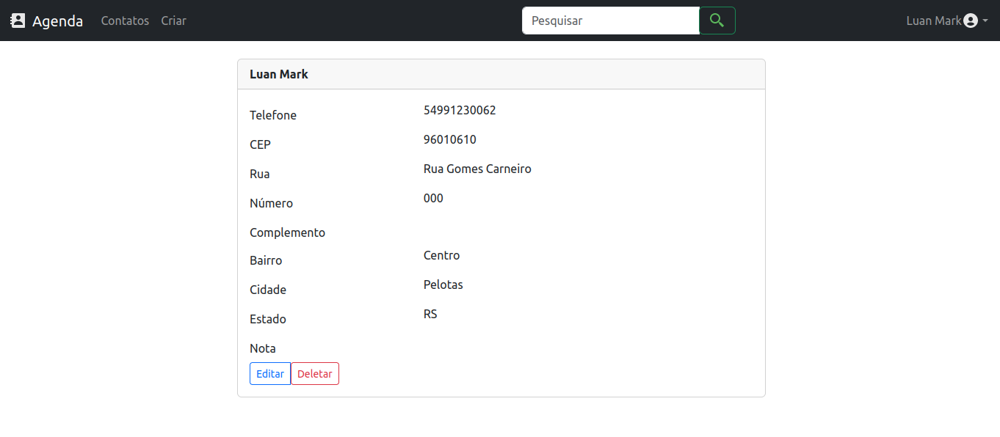

# Agenda Laravel

Este projeto foi desenvolvido com a intenção de demonstrar meus
conhecimentos sobre desenvolvimento com a framework Laravel.

## Metodologias utilizadas

Esta aplicação foi desenvolvido utilizando
**TDD** _(Test Driven Development)_,
garantindo uma grande cobertura de testes para o backend do projeto,
além disso, o fluxo _**GitHub Flow**_ foi utilizado para orientar 
e organizar de forma eficiente o controle de versão,
garantindo commits claros e focados em resolver problemas.

## Como rodar este projeto
Dentro da pasta do projeto:

- Renomeie o arquivo env.example para .env

- Insira suas informações do banco de dados no arquivo .env alterando os campos 
`DB_USERNAME='seu_usuário'` e `DB_PASSWORD='senha_do_seu_banco'`

- Realize a migração do banco de dados com o comando `php artisan migrate`

- Rode a aplicação com `php artisan serve`

- Agora você pode acessar a aplicação utilizando 
o endereço exibido na mensagem do terminal

## Screen Shots

